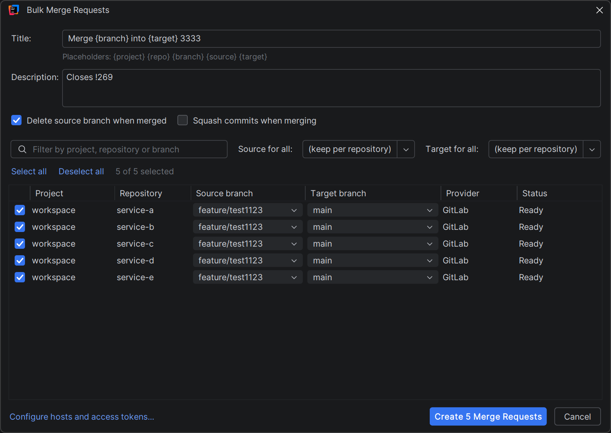

# Bulk Merge Requests

**One dialog. Every open project. All merge requests at once.**

Pick the source and target branch per repository in a single table, confirm once, and get one merge
request per repository. A repository that fails never stops the others.

Hosted services and your own servers alike.

## Install

`Settings | Plugins | Marketplace`, search for **Bulk Merge Requests**, install, restart. Or straight
from the [Marketplace page](https://plugins.jetbrains.com/plugin/33450-bulk-merge-requests).

## Setup

**1.** `Settings | Tools | Bulk Merge Requests` → **+**

| | |
|---|---|
| **Host** | `gitlab.com`, `github.com`, `codeberg.org` or your own server. Hosts of your open projects are already in the dropdown, and pasting a full URL works |
| **Provider** | GitLab, GitHub, Gitea or Forgejo |
| **Token** | GitLab: scope `api` · GitHub: `repo`, or *Pull requests: read and write* · Gitea and Forgejo: write access |

Tokens go into the IDE password safe, never into a settings file or a log.

**2.** Open the projects you want. One window with several repositories works as well as several
windows.

**3.** `Git | Bulk Merge Requests…`

## The dialog

| | |
|---|---|
| **Title**, **Description** | Templates, filled in per repository |
| **Source for all**, **Target for all** | Sets one branch everywhere. Repositories without that branch keep theirs |
| **Filter** | Matches project, repository and branch names. *Select all* and *Deselect all* apply to what you see |
| **Delete source branch**, **Squash** | GitLab only. The other hosts decide this when merging, so the boxes switch off and say so |

Placeholders: `{project}` `{repo}` `{branch}` `{source}` `{target}`. Unknown ones stay untouched, so
a typo is visible instead of silently gone. Default title: `Merge {branch} into {target}`.

Click a branch cell to pick from that repository's branches, or type one that does not exist yet.

### Greyed out rows

| Status | |
|---|---|
| No Git remote | Nothing to push to |
| No provider configured for this host | Add the host in the settings. The link at the bottom of the dialog takes you there, and the rows update when you return |
| No access token for this host | Same place |
| Source and target are identical | Pick another branch in that row |

## After the run

One notification, for example *Created 12 of 14 Merge Requests*.

If anything failed, a window lists every repository with its link or its error, and lets you open
them all, copy the links, or **retry only the failed ones**. Double click a row to open it.

Usual suspects: the source branch was never pushed, a merge request already exists, or the token
expired.

## Settings

| | |
|---|---|
| Default target branch | Preselected when a repository has a branch with that name |
| Title and description template | Defaults for the dialog, which also remembers your last run |
| Delete source branch when merged | On |
| Squash commits when merging | Off |
| Parallel requests | How many are created at once. 4 by default, 1 sends them one after another |

## License

[Apache 2.0](LICENSE) · Copyright 2026 Brielmayer Consulting GmbH
